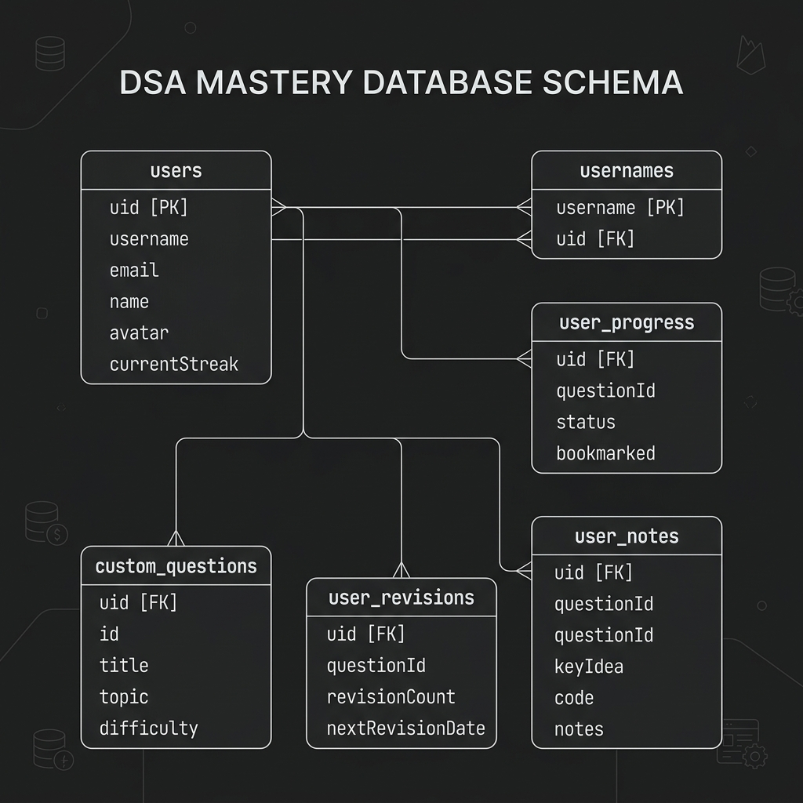
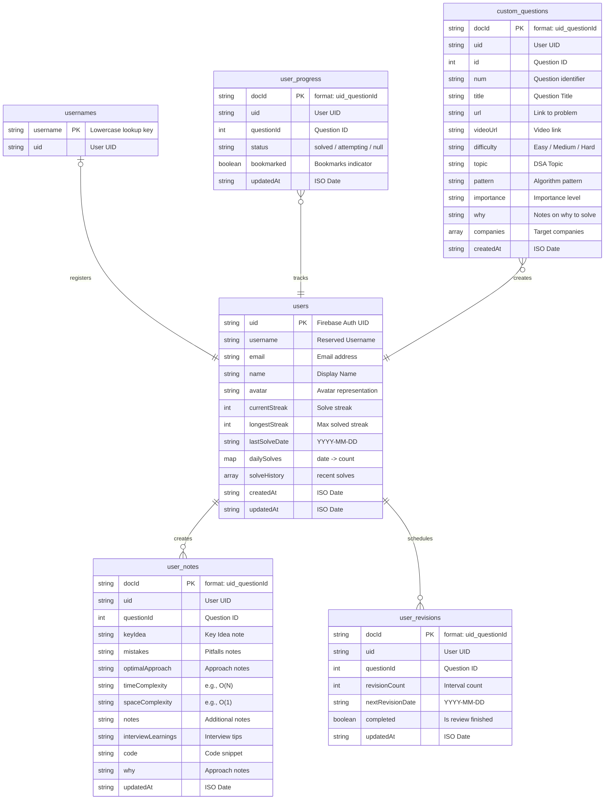

# DSA Mastery — Pattern-Based Interview Preparation

DSA Mastery is a modern, responsive React web application designed to help software engineers systematically prepare for technical interviews using pattern-based tracking, smart revision intervals, and daily solved streak logs.

## Core Features

- 🎯 **Pattern-Based Tracking:** Questions are grouped by patterns (e.g., Two Pointers, Sliding Window, DFS) for more efficient mental mapping.
- 📈 **GitHub-Style Solve Heatmap:** Visualizes daily solved stats over years to maintain streaks.
- ⏰ **Smart Revision Scheduler:** Spaced-repetition scheduling intervals (1, 3, 7, 15, 30 days) to lock in problem-solving logic.
- 📝 **Rich Problem Notes:** Add detailed insights, optimal complexity benchmarks (Time/Space), pitfalls, and code snippets directly on each problem.
- ➕ **Custom Question Creator:** Create and tag your own interview questions with difficulty, topics, importance, and company tags.
- 🛡️ **Firebase Security Integration:** Fine-grained security rule restrictions keeping your workspace completely private and secure.

---

## Architecture & Database Structure

The project has been refactored to use a professional, query-optimized, and clean database schema built on **Google Cloud Firestore**:

1. **`users` (Doc ID: `uid`):** Holds the primary user record, including email, username, avatar, current/longest streaks, and aggregated solve statistics (such as `dailySolves` and `solveHistory`). Consolidating these fields directly inside the user document eliminates the need for separate profile queries.
2. **`usernames` (Doc ID: lowercase `username`):** A registry table mapping usernames to UIDs. This guarantees global uniqueness and enables O(1) checks during signup or username edits without database scans.
3. **User Workspace Data (Doc ID: `${uid}_${questionId}`):** Solve statuses (`user_progress`), key-idea notes (`user_notes`), revisions (`user_revisions`), and custom questions (`custom_questions`) are tracked cleanly under direct paths, removing redundant profile fields.

---

### Database Entity Relationship (ER) Diagram (Mermaid)

---

## Security Architecture

1. **Authentication:** Managed securely via **Firebase Authentication** servers. User passwords are automatically hashed with Google's specialized cryptographic algorithms (such as `scrypt`) and are never exposed or saved to Firestore collections.
2. **Access Control:** Deployed rules inside `firestore.rules` protect document scopes:
   - User profile writes are restricted strictly to the document owner (`request.auth.uid == uid`).
   - Progress, notes, revisions, and custom questions can only be accessed or modified by their owner (`resource.data.uid == request.auth.uid`).

---

## Tech Stack

- **Frontend:** React, Zustand, React Router, TailwindCSS / CSS, Lucide React
- **Build System:** Vite
- **Cloud Backend:** Firebase Auth, Cloud Firestore
